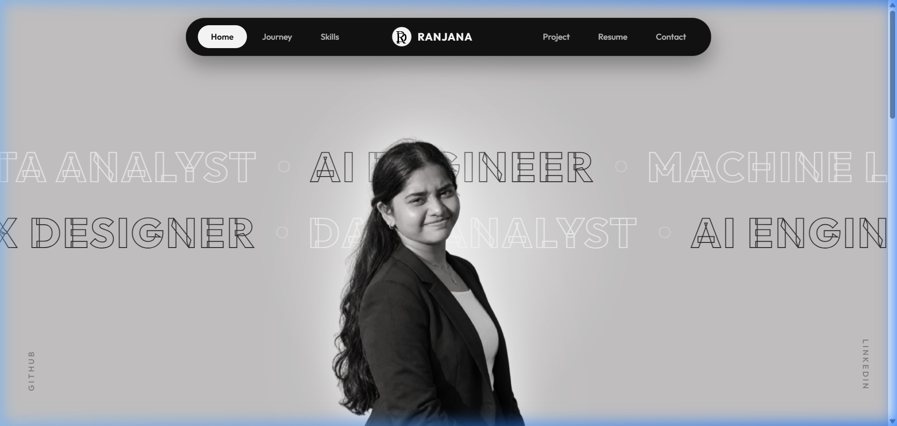
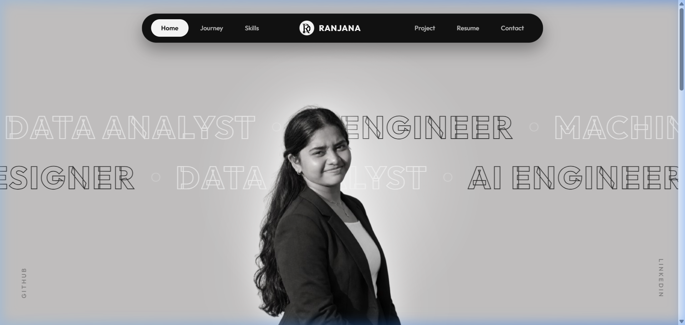
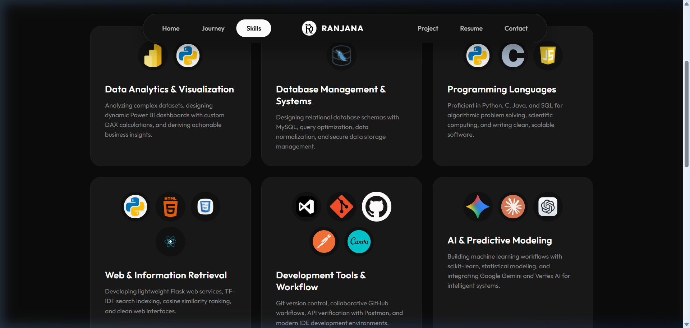
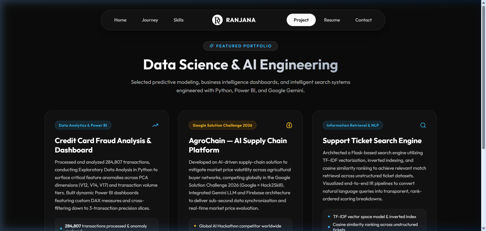
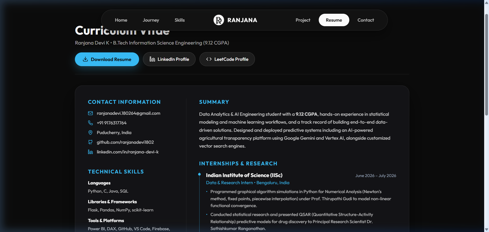
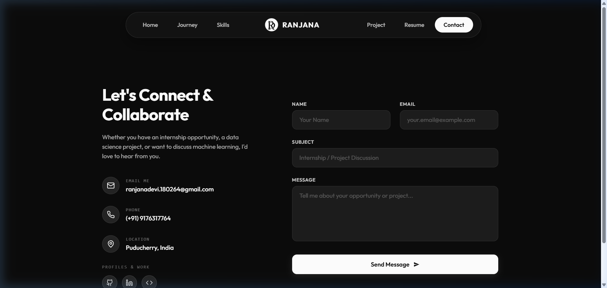

# Portfolio — Ranjana Devi K

[](https://react.dev/)
[](https://vitejs.dev/)
[](https://ranjanadevi1802.github.io/Portfolio/)
[](LICENSE)

> A modern, cinematic, and interactive personal portfolio web application built for **Ranjana Devi K** — Data Analytics & AI Engineering specialist. Engineered with **React 19**, **Vite**, and customized **CSS3**, featuring scroll-linked animations, dual-theme adaptation, interactive project showcases, and a split-glassmorphic contact interface.

---

## 📌 Table of Contents

- [Repository Name](#-Ranjana-Devi-K)
- [Project Overview](#-Portfolio-Overview)
- [Screenshots & Visual Preview](#-screenshots--visual-preview)
- [Key Features](#-key-features)
- [Source Code & Architecture](#-source-code--architecture)
- [Project Structure](#-project-structure)
- [Technology Stack](#-technology-stack)
- [Setup & Run Instructions](#-setup--run-instructions)
- [Configuration & Deployment](#-configuration--deployment)
- [About the Author](#-about-the-author)

---

## 🏷️ Repository- Portfolio

**`Portfolio`**  
GitHub Repository: [ranjanadevi1802/Portfolio](https://github.com/ranjanadevi1802/Portfolio)  
Live Site: [https://ranjanadevi1802.github.io/Portfolio/](https://ranjanadevi1802.github.io/Portfolio/)

---

## 📖 Project Overview

This repository houses the source code for the personal portfolio of **Ranjana Devi K**, an undergraduate student in Information Science Engineering (9.12 CGPA) specializing in **Machine Learning**, **Data Analytics**, **Data Science**, and **AI Engineering**.

### Why This Portfolio Stands Out
- **Cinematic Experience**: Scroll-synchronized scale, opacity, and translateY transitions that create depth and visual storytelling.
- **Dynamic Dual-Theming**: Automatically adapts themes across views — clean light neumorphism for the Home canvas and sleek modern dark-mode glassmorphism for Skills, Projects, Resume, and Contact.
- **Heavy UI Libraries**: Built with high-performance Vanilla CSS, bespoke glassmorphism, and custom keyframes without the overhead of heavy CSS frameworks.
- **Interactive Information Architecture**: Easy navigation between Home, Journey (Academics & Experience), Skills, Projects, Resume/CV, and Contact.

---

## 📸 Screenshots & Visual Preview

### 1. Home — Cinematic Marquee & Hero Section
*Featuring an animated dual-track marquee, smooth scroll-driven profile zoom, and a 3-column neumorphic overview.*



---

### 2. Journey — Interactive Timeline & Milestones
*Chronological roadmap detailing education, industry internships (IISc Bengaluru, Deloitte, Aravind Eye Hospital), and verified technical certifications.*



---

### 3. Skills — Technological Arsenal
*Interactive skills matrix covering Data Analytics, AI/ML, Databases, Web Systems, UI/UX, and Core CS Foundations.*



---

### 4. Projects — Featured Data & AI Portfolio
*Showcase of real-world predictive models, NLP search systems, and business intelligence dashboards with live repository links and architecture metrics.*



---

### 5. Curriculum Vitae — Interactive Resume
*Comprehensive view of technical competencies, academic milestones, research publications, and instant PDF download.*



---

### 6. Contact — Glassmorphic Communication Hub
*Interactive contact form powered by Web3Forms with automatic mailto fallback and radial cursor lighting effects.*



---

## ✨ Key Features

- **Scroll-Linked Hero Transformations**:
  - Zoom & Fade transitions on user scroll via React state hooks.
  - Multi-phase timeline loading using modern `IntersectionObserver` APIs.
- **Featured Projects Showcase**:
  - **Credit Card Fraud Analysis & Dashboard**: 284,807 transaction anomaly detection using Python EDA & custom Power BI DAX models.
  - **AgroChain — AI Supply Chain Platform**: Google Solution Challenge 2026 project integrating Gemini LLM, Vertex AI, and Firebase.
  - **Support Ticket Search Engine**: Information Retrieval pipeline using TF-IDF vectorization, inverted indexing, and cosine similarity scoring.
- **Curriculum Vitae / Resume Integration**:
  - Dedicated CV view mirroring industrial resumes.
  - Direct download button accessing the bundled PDF resume.
- **Functional Contact Pipeline**:
  - Split-panel glassmorphic interface with reactive mouse glow.
  - Form validation with asynchronous submissions via `Web3Forms` API and graceful fallback handling.
- **Fully Responsive**:
  - Mobile hamburger menu navigation with seamless tab switching.

---

## 💻 Source Code & Architecture

The application is structured as a Single Page Application (SPA) with tab-driven routing for zero page reload latency:

```
src/
├── App.jsx        # Core application component containing state, tabs, logic & markup
├── index.css      # Custom design system: layout, typography, animations & glassmorphism
└── main.jsx       # React 19 entry point and DOM root renderer
```

### Core Architecture Highlights

1. **State-Driven View Rendering (`App.jsx`)**:
   - `activeTab`: Controls the current active section (`'Home'`, `'About'`, `'Skills'`, `'Project'`, `'Resume'`, `'Contact'`).
   - `scrollTop` & `journeyScrollTop`: Track window/container scroll offsets to compute dynamic CSS transformations (scales, opacities, offsets).
   - `contactGlowRef`: Direct DOM reference tracking cursor coordinates to render dynamic radial glassmorphism illumination.

2. **Asset Path Resolution (`asset` helper)**:
   - Implements `asset(path)` referencing `import.meta.env.BASE_URL` to ensure flawless asset loading in both local development and sub-path production environments (e.g. GitHub Pages `/Portfolio/`).

3. **CSS Design Tokens (`index.css`)**:
   - Curated typography using Google Fonts: *Outfit* (headings) and *Plus Jakarta Sans* (body).
   - Glassmorphism tokens: `backdrop-filter: blur(...)`, semi-transparent borders (`rgba(255, 255, 255, 0.08)`), and neumorphic drop-shadows.

---

## 📂 Project Structure

```
Portfolio/
├── .gitignore               # Ignored files (node_modules, dist, etc.)
├── index.html               # Main HTML template with Google Fonts & metadata
├── package.json             # NPM package scripts and dependencies
├── package-lock.json        # Dependency lockfile
├── vite.config.js           # Vite configuration with base path and asset middleware
├── public/                  # Static assets served at root
│   ├── Icons/               # 40+ technology & partner SVGs/PNGs
│   ├── Images/              # Profile portraits, institutional logos & hero assets
│   ├── RanjanaDevi_Resume   # Raw resume asset
│   └── RanjanaDevi_Resume.pdf # Downloadable resume PDF
├── screenshots/             # High-resolution application screenshots for README
│   ├── about-preview.png
│   ├── contact-preview.png
│   ├── home-preview.png
│   ├── projects-preview.png
│   ├── resume-preview.png
│   └── skills-preview.png
└── src/                     # Application source code
    ├── App.jsx              # Main React component (navigation, sections, state)
    ├── index.css            # Complete styling design system & keyframes
    └── main.jsx             # React entry point
```

---

## 🛠️ Technology Stack

| Domain | Technology | Description |
| :--- | :--- | :--- |
| **Frontend Framework** | [React 19](https://react.dev/) | Component architecture, state management & hooks |
| **Build Tool & Bundler**| [Vite 6](https://vitejs.dev/) | Lightning-fast HMR and optimized production bundling |
| **Icons** | [Lucide React](https://lucide.dev/) | Clean, accessible SVG iconography |
| **Typography** | [Google Fonts](https://fonts.google.com/) | *Outfit* & *Plus Jakarta Sans* |
| **Styling & Effects** | Vanilla CSS3 | Custom animations, responsive layouts, glassmorphism |
| **Form Service** | [Web3Forms API](https://web3forms.com/) | Serverless form submission handling |
| **Deployment** | [gh-pages](https://www.npmjs.com/package/gh-pages) | Automated deployment to GitHub Pages |

---

## 🚀 Setup & Run Instructions

### Prerequisites
Make sure you have the following installed on your local environment:
- [Node.js](https://nodejs.org/) (Version **18.x** or higher recommended)
- [Git](https://git-scm.com/)
- NPM (comes bundled with Node.js)

### 1. Clone the Repository
```bash
git clone https://github.com/ranjanadevi1802/Portfolio.git
cd Portfolio
```

### 2. Install Dependencies
```bash
npm install
```

### 3. Start the Development Server
```bash
npm run dev
```
Once the dev server boots up, open your browser and navigate to:
```
http://localhost:5173/Portfolio/
```

### 4. Build for Production
To compile and bundle optimized static assets:
```bash
npm run build
```
The output will be placed in the `dist/` directory.

### 5. Preview Production Build Locally
```bash
npm run preview
```

---

## ⚙️ Configuration & Deployment

### Vite Configuration (`vite.config.js`)
The project is configured with a base URL matching the GitHub Pages repository slug:
```javascript
export default defineConfig({
  base: '/Portfolio/',
  // Custom middleware handles case normalization and rewrite fallbacks
})
```

### Deploying to GitHub Pages
To publish updates to GitHub Pages:
```bash
npm run deploy
```
This automatically triggers `npm run build` via `predeploy`, then pushes the contents of `dist/` to the `gh-pages` branch.

### Customizing Contact Form
The contact form in `src/App.jsx` submits to Web3Forms using an access key:
```javascript
const res = await fetch("https://api.web3forms.com/submit", {
  method: "POST",
  headers: { "Content-Type": "application/json" },
  body: JSON.stringify({
    access_key: "e0dec84b-4cf2-402f-b3d1-4cedc5c280e2",
    // form fields...
  })
});
```
To receive emails directly, replace `access_key` with your free key from [Web3Forms](https://web3forms.com/).

---

## 👩‍💻 About the Author

**Ranjana Devi K**  
*Data Analytics & AI Engineering Specialist*  
Women's Engineering College, Puducherry  

- **GitHub**: [@ranjanadevi1802](https://github.com/ranjanadevi1802)
- **LinkedIn**: [Ranjana Devi K](https://www.linkedin.com/in/ranjana-devi-k-b972013a9/)
- **LeetCode**: [Ranjana_18](https://leetcode.com/u/Ranjana_18/)
- **Email**: [ranjanadevi.180264@gmail.com](mailto:ranjanadevi.180264@gmail.com)

---

## 📄 License

This project is licensed under the MIT License — feel free to explore, learn from, and adapt for personal use.
